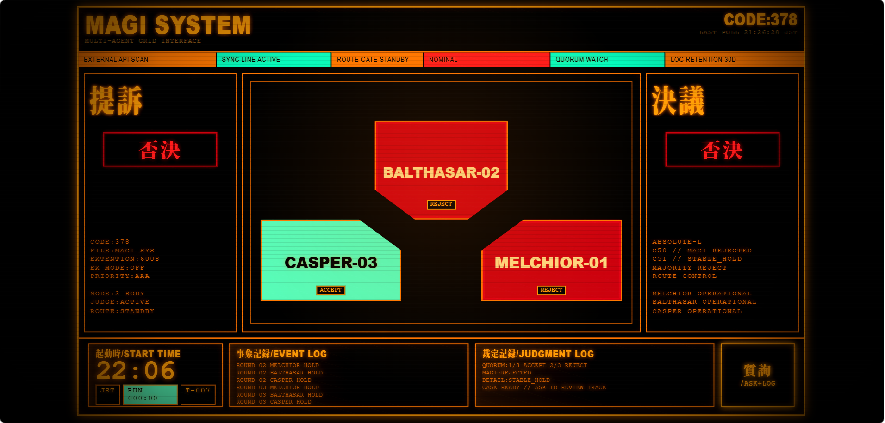

# MAGI

MAGI is a 1995 EVA/MAGI-style multi-agent deliberation terminal. Three bio-computer nodes (MELCHIOR, BALTHASAR, CASPER) each run a distinct personality partition over an OpenAI-compatible API. They independently evaluate a question, cross-review each other's positions across multiple rounds, and resolve by quorum with a full replayable case trace.



## Architecture

```
index.html + style.css          Terminal UI (fixed 1365x768 stage, viewport-scaled)
        |
     app.js                     Client orchestrator: state, rendering, deliberation dispatch
        |
  +-----------+------------------+
  |           |                  |
REPLAY      BYO KEY            LOCAL
  |           |                  |
fixtures.js  model-client.js    deliberation-server.js
             (browser fetch)    (Node.js proxy, port 3001)
                    |                  |
                    +--------+---------+
                             |
                     orchestrator.js     Multi-round convergence loop
                             |
                       protocol.js       Position/action parsing, judgment, convergence analysis
                             |
                       sound.js          Web Audio cue system (vote, accepted, rejected, error)
```

The three play modes:

- `REPLAY`: static fixture replay. No key, no backend.
- `BYO KEY`: browser-memory OpenAI-compatible mode. Bring a disposable low-limit API key.
- `LOCAL`: local proxy mode for development.

## Quick Start

Run the static UI:

```powershell
npm start
```

Open:

```text
http://localhost:3000
```

Click `質詢/ASK+LOG` in the bottom-right console to open the interrogation panel, final verdict, and decision log.

## Play Modes

### REPLAY

`REPLAY` is the default public demo path. It loads `test/fixtures/magi-case-sample.json`, runs a five-second MAGI deliberation animation, then shows the stored case result and trace log.

Use this when you want to see the ritual without an API key.

### BYO KEY

`BYO KEY` calls an OpenAI-compatible chat-completions API directly from your browser.

Use only disposable, low-limit keys. The key is held in browser memory only. MAGI does not write it to `localStorage`, `sessionStorage`, or the repo.

Provider presets:

| Preset | Base URL | Default model |
|--------|----------|---------------|
| `DEEPSEEK` | `https://api.deepseek.com` | `deepseek-v4-pro` |
| `OPENAI` | `https://api.openai.com/v1` | `gpt-4o-mini` |
| `OPENROUTER` | `https://openrouter.ai/api/v1` | `openai/gpt-4o-mini` |
| `CUSTOM` | blank | blank |

Advanced per-node override JSON:

Leave this blank to run all three MAGI partitions through the same global API key, base URL, and model. Fill it only when you want MELCHIOR, BALTHASAR, and CASPER to use different OpenAI-compatible endpoints or models.

```json
{
  "melchior": { "model": "gpt-4o-mini" },
  "balthasar": { "baseUrl": "https://api.deepseek.com", "model": "deepseek-v4-pro" },
  "casper": { "baseUrl": "https://openrouter.ai/api/v1", "model": "openai/gpt-4o-mini" }
}
```

Any missing per-node field falls back to the global BYO key/base URL/model.

### LOCAL

`LOCAL` posts to a local proxy at `http://localhost:3001/api/deliberate`.

Start the proxy in another terminal:

```powershell
node deliberation-server.js
```

Optional `.env`:

```env
DEEPSEEK_API_KEY=sk-...
DEEPSEEK_MODEL=deepseek-v4-pro
OPENAI_COMPATIBLE_BASE_URL=https://api.deepseek.com
```

## MAGI Nodes

The three nodes are not generic assistant personas. They are three incompatible loyalties split from Dr. Naoko Akagi's Personality Transplant OS:

- `MELCHIOR-1`: Naoko as scientist. Preserves mechanism, proof, instrumentation, and technical necessity.
- `BALTHASAR-2`: Naoko as mother. Preserves Ritsuko, the child, created life, and what asks to be saved.
- `CASPER-3`: Naoko as woman. Preserves private desire, attachment, humiliation, jealousy, and the man she cannot release.

Each node returns structured JSON. MAGI preserves dissent and resolves the final case by quorum.

## Convergence Protocol

MAGI runs a bounded multi-round convergence loop (max 4 rounds, 12 model calls):

1. **Round 1 (Independent):** Each node receives the question alone and returns `accept`, `reject`, or `deliberate` with reasoning and confidence.
2. **Round 2+ (Cross-Review):** Each node reads the previous round's peer brief and returns `hold`, `revise`, or `no_go` with a critique.

### Termination conditions

| Condition | Result |
|-----------|--------|
| Any node issues `no_go` | Immediate stop, verdict = `no_go` |
| Unanimous `accept` or `reject` | Immediate stop, verdict = accepted/rejected |
| Two consecutive cross-review rounds with identical positions and all `hold` | Stop as `stable_hold` |
| Position signature repeats (oscillation) | Stop as `oscillation`, verdict forced to `deliberate` |
| Round or model-call budget exhausted | Stop as `budget_exhausted` |

### Judgments

- **Unanimous:** All three nodes agree.
- **Majority with dissent:** Two agree, one dissents. Dissent is preserved in the trace.
- **Deadlock:** No majority. Verdict = `deliberate`.
- **Partial:** Some nodes errored but a majority still reached quorum.
- **Failed:** Too few usable responses.

Each completed case includes a `termination` block with the stop reason, final round count, and model-call budget usage. The `ASK+LOG` panel shows the verdict above the full round-by-round decision log.

## Sound System

MAGI includes a Web Audio cue system (`src/deliberation/sound.js`) that plays distinct tones for different events:

| Cue | Trigger |
|-----|---------|
| `access` | Panel open/close, mode switch |
| `vote` | Deliberation in progress (repeating) |
| `accepted` | Verdict = accepted |
| `rejected` | Verdict = rejected or no_go |
| `error` | Provider failure or model error |

Sound is disabled by default. Click any interactive element to arm the audio context (browser autoplay policy). The `SOUND:ARMED` / `SOUND:SAFE` indicator in the status bar shows the current state.

## Case Export / Import

Completed deliberation cases can be exported as JSON and re-imported later:

- **Export:** Click `搬出/EXPORT` in the ASK+LOG panel. Downloads the full case file including all rounds, messages, judgment, and termination metadata.
- **Import:** Click `搬入/IMPORT` and select a previously exported case JSON. The terminal replays the case result and trace log without re-running the model.

Case files follow the protocol defined in `src/deliberation/protocol.js` and can be validated with `validateCase()`.

## Development

Run tests:

```powershell
npm test
```

Test suite covers:
- Deliberation protocol parsing (independent + cross-review messages)
- Convergence analysis (all termination conditions)
- Case validation and artifact building
- Provider status polling and routing posture
- Model client empty-response retry logic

Poll provider status and refresh static output:

```powershell
npm run poll
```

Syntax checks used during development:

```powershell
node --check app.js
node --check deliberation-server.js
node --check src\deliberation\model-client.js
node --check src\deliberation\orchestrator.js
node --check src\deliberation\protocol.js
```

`dist/` is ignored by git, but is maintained locally as the static preview output.

## Safety Notes

- Do not commit `.env`.
- Do not use production API keys in browser BYO mode.
- Some providers may block browser requests with CORS. Use `LOCAL` mode for those providers.
- `BYO KEY` is for public experimentation, not production secret storage.
- API keys are held in browser memory only. MAGI does not write them to `localStorage`, `sessionStorage`, or the repo.

## Versioning

See [CHANGELOG.md](CHANGELOG.md) for release history. Current version: `1.0.0`.

## Technical Documentation

See [TECHNICAL.md](TECHNICAL.md) for protocol design, convergence algorithm, error handling, and architecture decisions.
